# 🍽️ Meal Planner App

A Flutter application that helps users plan, track, and explore healthy meals with a smooth and modern user experience.

---

## 🧠 Overview

The app provides personalized meal plans, daily progress tracking, grocery list management, and a built-in chat assistant — all wrapped in a visually appealing and user-friendly interface.

---

## ✨ Features

-  **Onboarding Screens** using PageView
-  **Daily Progress Tracker**
-  **Meal Plan** with TabBarView (All Meals + Favorites)
-  **Grocery List** with interactive checkboxes and delete option
-  **Recipe Details** with ingredients and cooking steps
-  **Chat screen** simulating basic message flow
-  **Settings page** with a support section and logout confirmation
-  **Support Screen** with phone and WhatsApp integration


---

## 📦 Packages Used

| Package          | Purpose                             |
|------------------|-------------------------------------|
| `shimmer`        | Adds shimmer loading placeholders   |
| `url_launcher`   | Opens phone/WhatsApp from support   |
| `fluttertoast`   | Shows toast messages in settings    |

---

## 🖼️ Screenshots
<p float="left">
  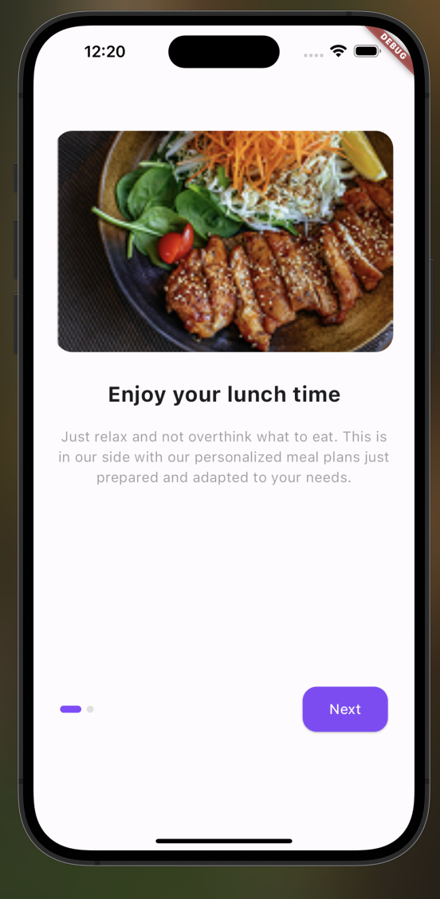
  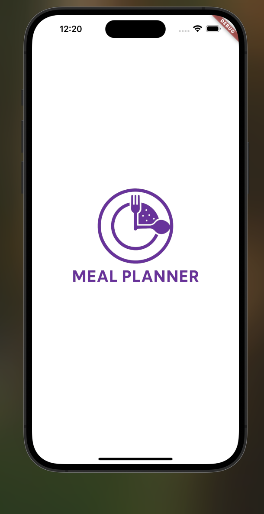
  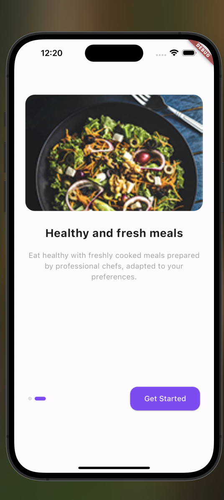
  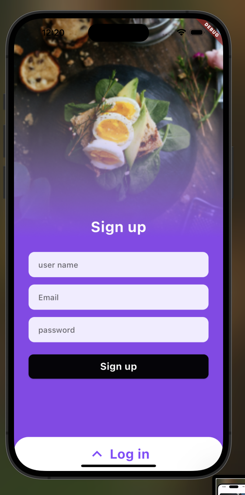
  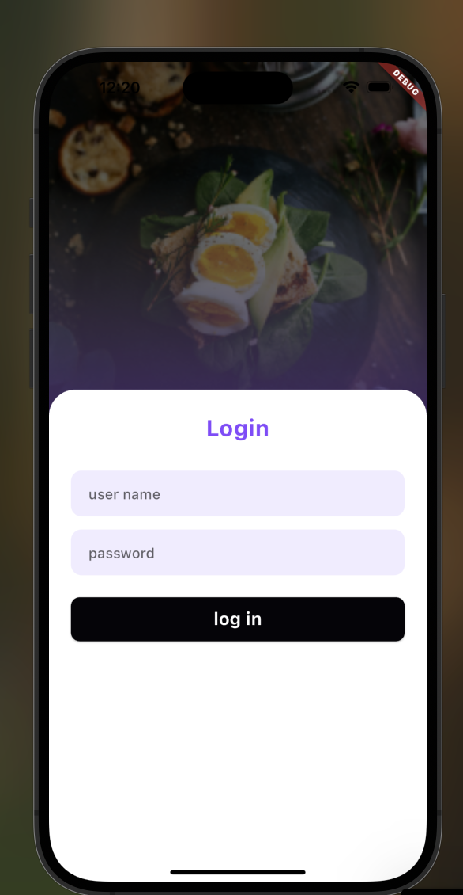
  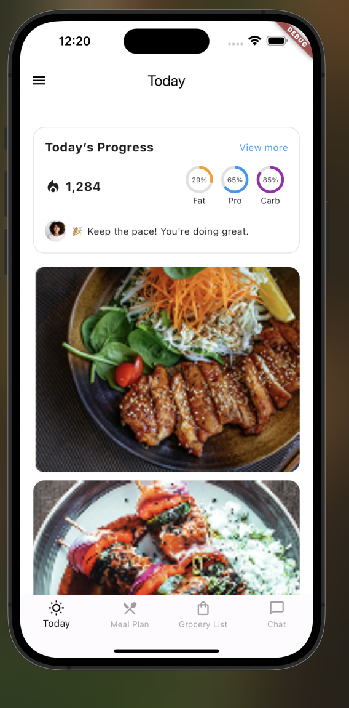
  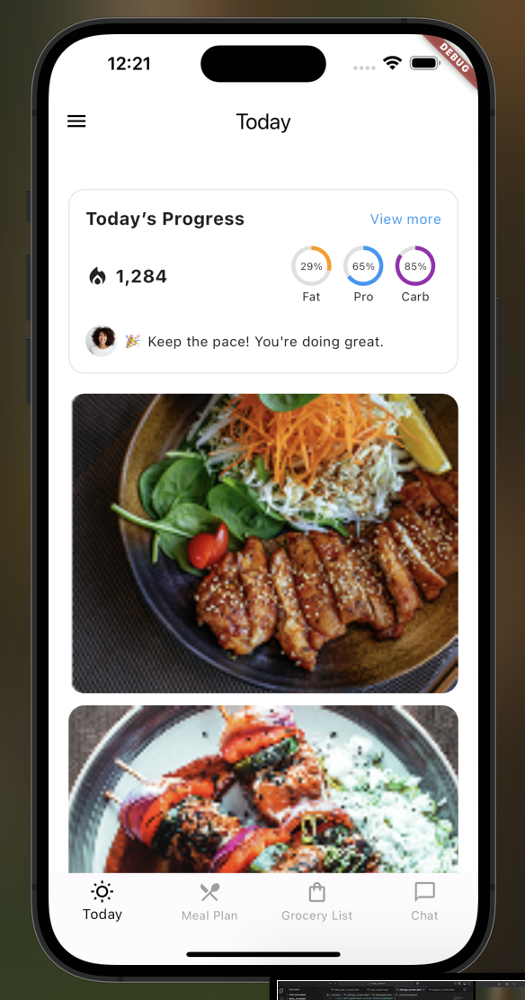
  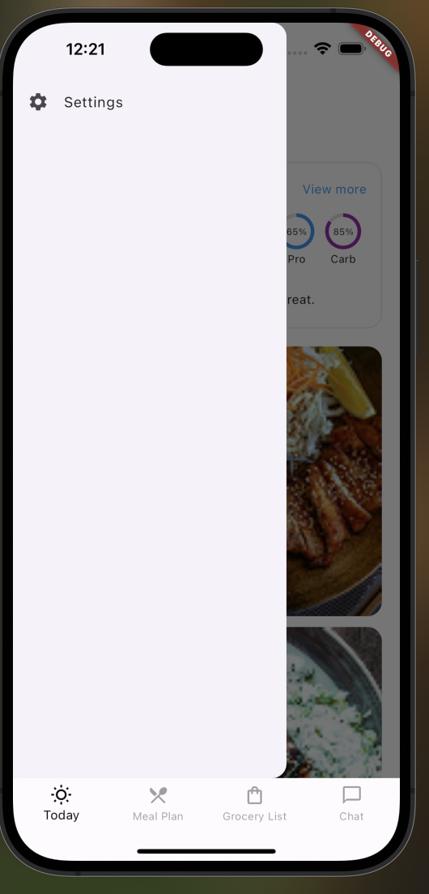
  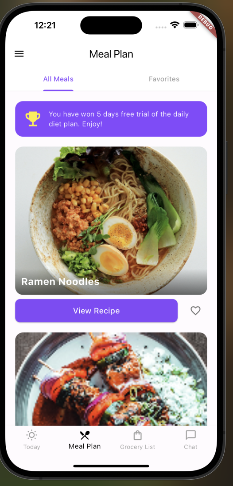
  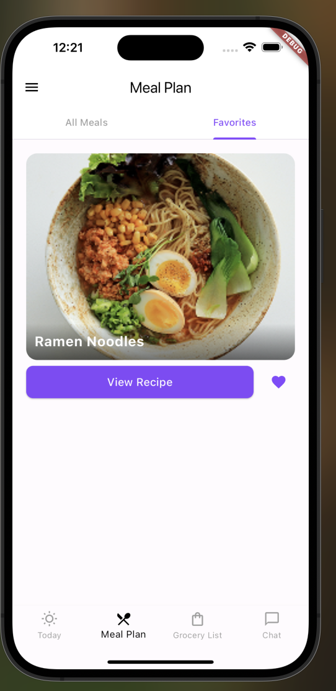
  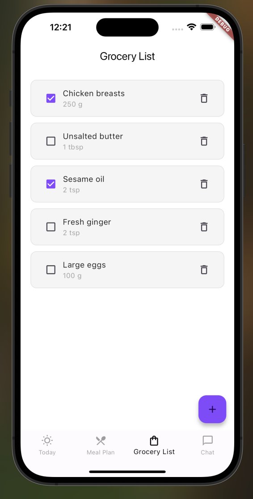
  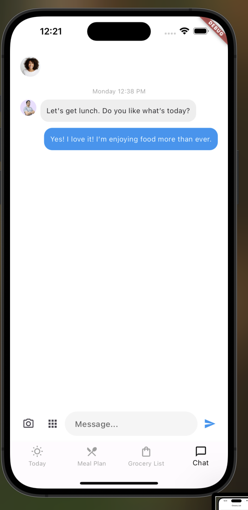
  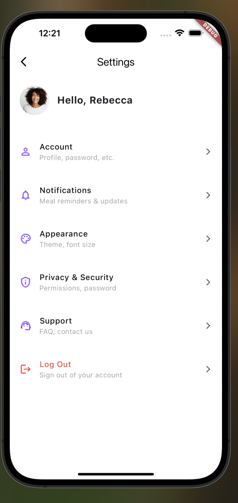
  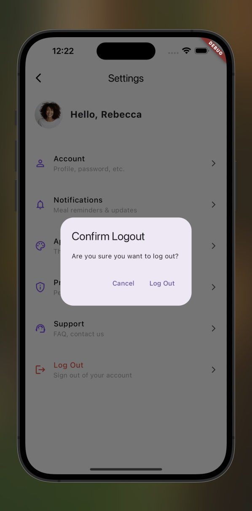
  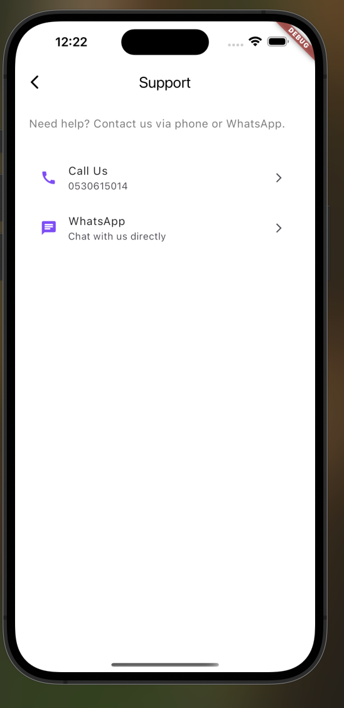
  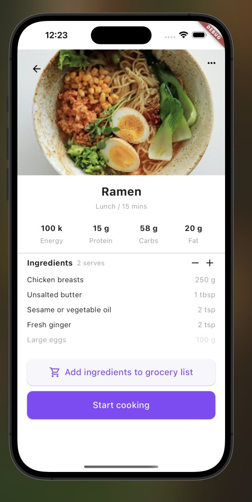
  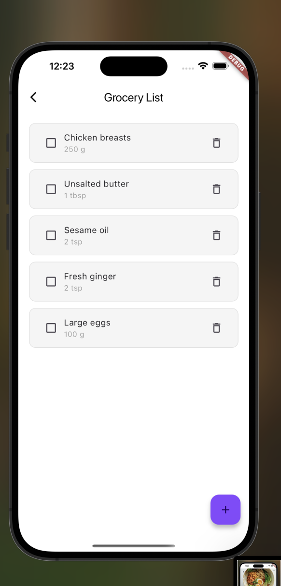
  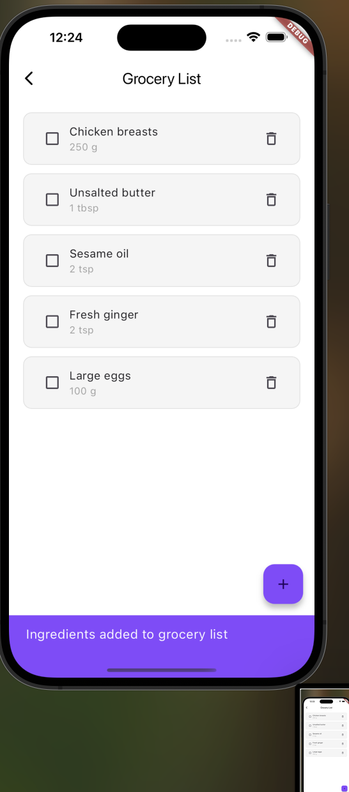
  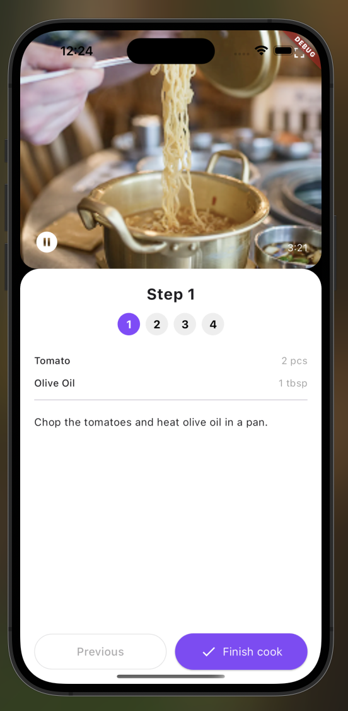
  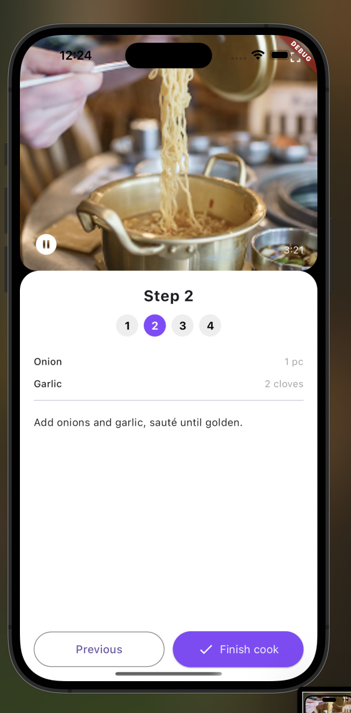
  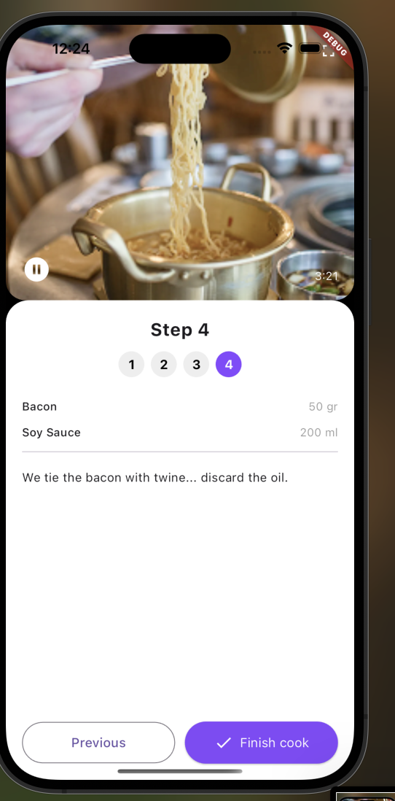
</p>


## 🛠️ How to Run

1. **Clone the repo:**
   ```bash
   git clone https://github.com/your_username/meal_planner_app.git
   cd meal_planner_app
   
2. Navigate to the project directory:
cd meal_planner
3. Install dependencies:
flutter pub get
4. Run the app:
flutter run


 Author
Manal Almarri
📍 Riyadh, Saudi Arabia
github : manaalq


